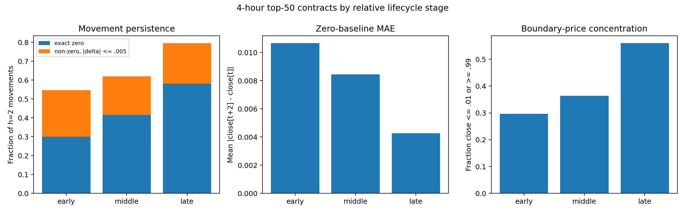
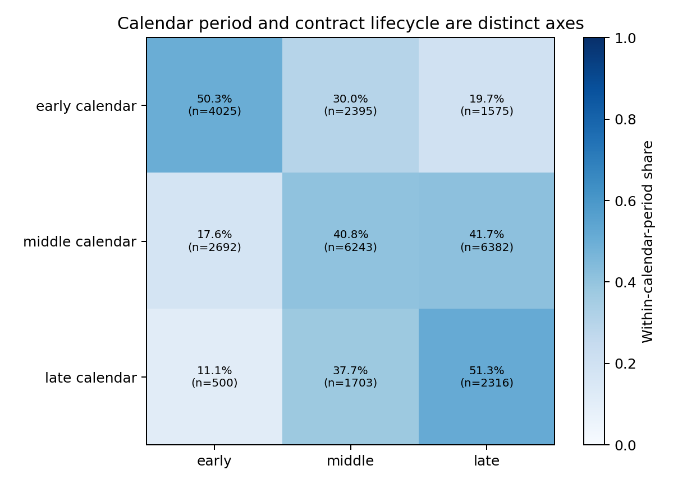
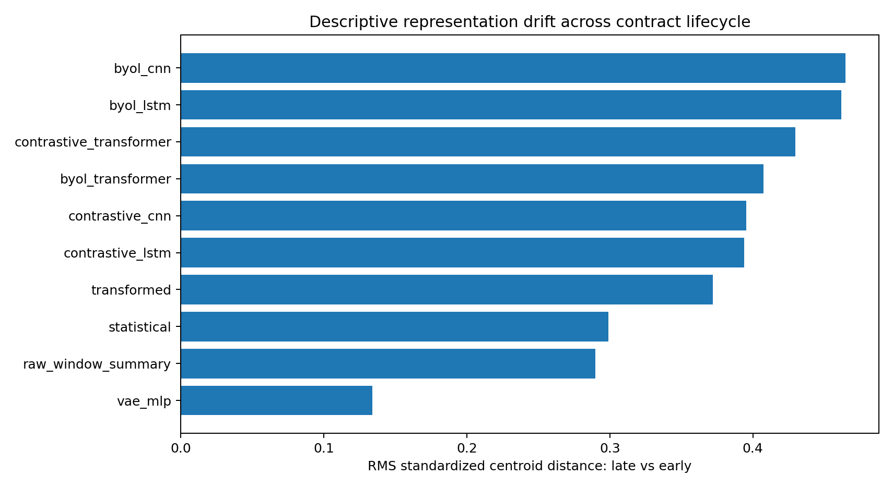

# Phase 4 Calendar and Contract-Lifecycle Exploration

Date: 2026-09-20
Status: Exploratory design evidence; not a confirmatory model evaluation

## 1. Question

Phase 3 showed that a single per-contract final-20% test tail is dominated by
near-settlement persistence. This analysis asks:

1. whether 4-hour prediction-market dynamics differ systematically across the
   early, middle, and late portions of a contract;
2. whether global calendar period and relative contract lifecycle are distinct
   sources of variation; and
3. whether the saved Phase 3 feature branches contain measurable lifecycle
   drift that motivates Phase 4 encoder adaptation or conditioning.

The claim under investigation is deliberately limited. Distribution and
embedding drift can justify global-calendar retraining and a lifecycle-aware
ablation, but cannot by itself prove that different encoder architectures are
required for different lifecycle stages.

## 2. Relationship to prior work

The exact Phase 4 combination—a pooled prediction-market model with a
multi-branch self-supervised encoder retrained at each global calendar cutoff—
was not found in the focused literature search. Its components have clear
precedent:

| area | example | relevance and boundary |
|---|---|---|
| Prediction-market horizon effects | Page and Clemen, [*Do Prediction Markets Produce Well-Calibrated Probability Forecasts?*](https://doi.org/10.1111/j.1468-0297.2012.02561.x) | Shows that time to expiration affects prediction-market calibration. It does not study learned encoders. |
| Prediction-market price-change definition | Restocchi, McGroarty, and Gerding, [*The stylized facts of prediction markets: Analysis of price changes*](https://doi.org/10.1016/j.physa.2018.09.183) | Finds conventional percentage/log returns unsuitable for bounded prediction-market prices and analyzes raw price changes. This supports signed probability movement as the primary target. |
| Walk-forward neural forecasting | [*Forecasting Financial Time Series through Causal and Dilated Convolutional Neural Networks*](https://pmc.ncbi.nlm.nih.gov/articles/PMC7597190/) | Retrains/evaluates neural forecasting models through temporally ordered walk-forward folds. It is not a self-supervised representation study or prediction-market study. |
| Autoencoder forecasting with walk-forward evaluation | [*Supervised autoencoder MLP for financial time series forecasting*](https://doi.org/10.1186/s40537-025-01267-7) | Applies walk-forward retraining to an encoder-based financial model. It is supervised, asset-focused, and does not use pooled event-contract lifecycles. |
| Non-stationary time-series representations | Tonekaboni, Eytan, and Goldenberg, [*Unsupervised Representation Learning for Time Series with Temporal Neighborhood Coding*](https://arxiv.org/abs/2106.00750) | Learns representations intended to track changing latent temporal states. It supports treating non-stationarity as a representation problem, but does not prescribe Phase 4's global-calendar split. |

Therefore, global walk-forward retraining is established methodology and
lifecycle-dependent prediction-market behaviour is established domain
evidence. Their use together in this framework is best described as a
domain-motivated experimental design, not claimed as a new learning algorithm.

## 3. Data and method

The diagnostic uses the Phase 3 selected top-50 4-hour contracts, sequence
length 64, and an eight-hour target horizon (`h=2`). The raw analysis contains
27,831 eligible decision rows from all 50 contracts between 2024-07-09 and
2025-12-31.

For each contract, eligible rows were assigned to equal relative-lifecycle
thirds:

- early: first third of the observed contract timeline;
- middle: second third; and
- late: final third.

The first 63 raw rows remain context-only because a length-64 input is required.
Targets never cross a contract endpoint. Exact-zero movement, movement within
`0.005`, boundary-price concentration (`close <= 0.01` or `close >= 0.99`),
zero-baseline MAE/RMSE, and bar range were measured. Late-minus-early effects
were computed within each contract and summarized with a 10,000-draw contract
bootstrap and a paired Wilcoxon diagnostic. This avoids treating all
stride-one rows as independent observations.

Global calendar time was divided into three equal-duration exploratory bins.
Those boundaries were chosen after observing data coverage and are not proposed
Phase 4 cutoffs.

The representation diagnostic aligns all 24,781 saved Phase 3 feature rows
with contract, timestamp, and raw-window identities. Each feature coordinate
was standardized with the saved Phase 3 training rows. Drift is reported as
the root-mean-square standardized centroid distance between stages. A
five-fold, contract-grouped ridge linear probe measures whether lifecycle stage
is descriptively separable in each branch; chance balanced accuracy is
approximately `0.333`.

The neural feature results are not causal Phase 4 performance. Those encoders
were trained under the Phase 3 80/20 contract and are used only to diagnose the
structure already present in their representation spaces.

## 4. Raw lifecycle results

| metric | early | middle | late |
|---|---:|---:|---:|
| eligible rows | 7,217 | 10,341 | 10,273 |
| contracts | 50 | 50 | 50 |
| exact zero movement | 30.00% | 41.61% | 58.06% |
| `abs(delta) <= 0.005` | 54.69% | 61.98% | 79.57% |
| price at or near 0/1 | 29.62% | 36.31% | 55.97% |
| zero-movement baseline MAE | 0.010659 | 0.008450 | 0.004268 |
| zero-movement baseline RMSE | 0.023724 | 0.019160 | 0.014085 |
| 95th percentile absolute movement | 0.0400 | 0.0392 | 0.0200 |
| mean within-bar high-low range | 0.017200 | 0.012820 | 0.008025 |

The contract-paired late-minus-early effects were:

| metric | mean difference | contract-bootstrap 95% interval | paired Wilcoxon `p` |
|---|---:|---:|---:|
| exact-zero fraction | +0.2162 | [+0.1374, +0.3009] | 0.000019 |
| stable-within-0.005 fraction | +0.2540 | [+0.1756, +0.3360] | 0.000001 |
| boundary-price fraction | +0.2797 | [+0.1840, +0.3806] | 0.000008 |
| zero-baseline MAE | -0.006668 | [-0.009695, -0.003977] | <0.000001 |
| mean bar range | -0.009261 | [-0.015337, -0.004230] | 0.000338 |

Late lifecycle rows are therefore more concentrated near settlement values,
more likely to be unchanged, and smaller in both cross-horizon movement and
within-bar range. This confirms that the Phase 3 final-tail behaviour is a
systematic lifecycle effect across contracts rather than only a pooled-row
artifact.



## 5. Calendar time and lifecycle are different axes

The exploratory calendar bins contain different contract cohorts: 33 active
contracts in the first period, 35 in the middle, and only 9 in the last. Their
lifecycle composition was:

| calendar period | early lifecycle | middle lifecycle | late lifecycle |
|---|---:|---:|---:|
| early calendar | 50.3% | 30.0% | 19.7% |
| middle calendar | 17.6% | 40.8% | 41.7% |
| late calendar | 11.1% | 37.7% | 51.3% |

All calendar periods contain all lifecycle stages, while their proportions and
contract universes differ. Consequently:

- a global calendar cutoff is required to reproduce information availability;
- lifecycle stage must still be reported inside each walk; and
- a per-contract lifecycle split cannot substitute for a global deployment
  simulation.



## 6. Representation drift

| feature branch | dimension | standardized early-late centroid distance | contract-grouped lifecycle probe balanced accuracy |
|---|---:|---:|---:|
| BYOL CNN | 128 | 0.465 | 0.433 |
| BYOL LSTM | 128 | 0.462 | 0.481 |
| Contrastive Transformer | 128 | 0.430 | 0.562 |
| BYOL Transformer | 128 | 0.407 | 0.478 |
| Contrastive CNN | 128 | 0.395 | 0.462 |
| Contrastive LSTM | 128 | 0.394 | 0.507 |
| Transformed | 55 | 0.372 | 0.473 |
| Statistical | 70 | 0.299 | 0.482 |
| Raw-window summary | 15 | 0.290 | 0.378 |
| VAE MLP | 64 | 0.134 | 0.511 |

Every saved branch carries lifecycle-separable information above the nominal
one-third chance level, including when the probe holds out complete contracts.
Most contrastive and BYOL branches also show larger standardized early-late
centroid movement than the simple raw-window summary. The VAE illustrates why
centroid drift alone is incomplete: it has the smallest mean shift but retains
linearly decodable lifecycle information across multiple coordinates.



These results show that the input distribution and learned representation
space vary with lifecycle. They do not show that a particular branch fails in
late life, nor that different backbone architectures are necessary.

## 7. Supported claim and Phase 4 test

The supported research-write-up claim is:

> Prediction-market contracts exhibit lifecycle-dependent price dynamics, and
> the saved representations encode those changes. A pooled evaluation must use
> global calendar cutoffs for causal information availability, report lifecycle
> strata within each walk, and test whether the representation must adapt over
> time.

The stronger statement—different feature-extractor architectures are required
for different lifecycle periods—remains a hypothesis. Phase 4 should separate
three effects on identical global-walk rows:

1. **Fixed representation:** train the encoder at the earliest cutoff, freeze
   it across later walks, and retrain only the downstream head.
2. **Adaptive representation:** retrain the same encoder architecture from
   scratch on the permitted history of every walk.
3. **Lifecycle-aware representation (optional):** condition one shared encoder
   or the downstream head on decision-time lifecycle metadata, or compare
   predeclared stage-specific experts if the metadata and sample sizes support
   it.

Only paired downstream results can establish that adaptive or stage-specific
feature extraction prevents the Phase 3 failure. Raw and representation drift
alone cannot make that causal performance claim.

## 8. Reproducibility and artifacts

The exploration was executed by the temporary script
`/tmp/explore_phase4_calendar_lifecycle.py`. Persistent numerical and visual
artifacts are stored under:

```text
experiments/phase4/diagnostics/calendar_lifecycle_exploration/
```

The directory contains CSV tables for lifecycle, calendar, contract-paired,
and feature-branch results; three figures; and `summary.json` with source hashes
and limitations. No encoder or downstream training was launched.
