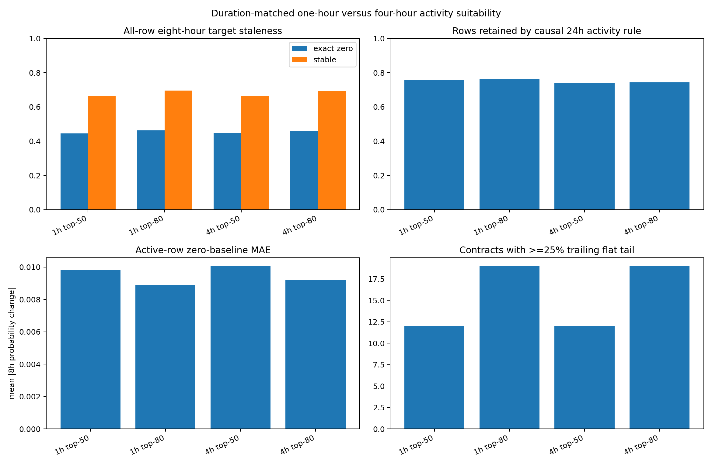

# Top-50/Top-80 One-Hour versus Four-Hour Activity Comparison

Status: exploratory data analysis only; no model training or selection.

The comparison holds temporal meaning fixed: 256 hours of input context, an eight-hour future probability-change target, and a causal prior-24h price-change activity rule. The same four-hour early-prefix rank defines contract identity.

## All-row comparison

| timeframe | top_k | contracts | raw_rows | model_eligible_rows | minimum_lifespan_hours | median_lifespan_hours | median_contract_close_std | median_contract_meaningful_fraction | pooled_zero_move_fraction | pooled_stable_fraction | pooled_mean_absolute_move | pooled_median_absolute_move | pooled_p90_absolute_move | contracts_meaningful_lt_10pct | contracts_close_std_lt_001 | contracts_flat_run_ge_24h | contracts_flat_run_ge_72h | contracts_trailing_flat_ge_25pct |
| --- | --- | --- | --- | --- | --- | --- | --- | --- | --- | --- | --- | --- | --- | --- | --- | --- | --- | --- |
| 1h | 50 | 50 | 124112 | 110962 | 1285 | 1648 | 0.0827274 | 0.40363 | 0.445603 | 0.665967 | 0.00740789 | 0.001 | 0.02 | 8 | 7 | 30 | 18 | 12 |
| 1h | 80 | 80 | 192658 | 171618 | 1285 | 1648 | 0.0728927 | 0.393588 | 0.462288 | 0.695737 | 0.00679544 | 0.001 | 0.02 | 20 | 17 | 51 | 33 | 19 |
| 4h | 50 | 50 | 31081 | 27831 | 1288 | 1648 | 0.0846353 | 0.400548 | 0.446696 | 0.665804 | 0.00747913 | 0.001 | 0.02 | 8 | 7 | 44 | 20 | 12 |
| 4h | 80 | 80 | 48246 | 43046 | 1288 | 1648 | 0.0735856 | 0.387868 | 0.461808 | 0.694373 | 0.00687386 | 0.001 | 0.02 | 20 | 17 | 71 | 36 | 19 |

## Causal prior-24h activity comparison

| timeframe | top_k | eligibility | rows | retained_fraction | contracts | zero_move_fraction | stable_fraction | mean_absolute_move | median_absolute_move | p90_absolute_move |
| --- | --- | --- | --- | --- | --- | --- | --- | --- | --- | --- |
| 1h | 50 | recent_price_change_24h | 83784 | 0.755069 | 50 | 0.266268 | 0.557672 | 0.00980988 | 0.003 | 0.024 |
| 1h | 80 | recent_price_change_24h | 130878 | 0.762612 | 80 | 0.296077 | 0.601209 | 0.00890714 | 0.002 | 0.02 |
| 4h | 50 | recent_price_change_24h | 20620 | 0.7409 | 50 | 0.260378 | 0.55097 | 0.0100658 | 0.003 | 0.028 |
| 4h | 80 | recent_price_change_24h | 32016 | 0.743762 | 80 | 0.285576 | 0.591111 | 0.00921046 | 0.002 | 0.0207 |

## Timestamp-aligned target agreement

| top_k | aligned_targets | fraction_of_4h_targets_aligned | exact_delta_agreement | delta_mean_absolute_difference | delta_correlation | activity_rule_agreement |
| --- | --- | --- | --- | --- | --- | --- |
| 50 | 27746 | 0.996946 | 0.893498 | 0.000945581 | 0.972013 | 0.985764 |
| 80 | 42917 | 0.997003 | 0.881213 | 0.000971853 | 0.969003 | 0.980917 |

Raw timestamps are treated as bar starts, so decision and target availability times are shifted by one hour for 1h bars and four hours for 4h bars. This also aligns a 4h close with the corresponding final 1h close in its bar.

## Lifecycle comparison

| timeframe | top_k | lifecycle_stage | rows | contracts | zero_move_fraction | stable_fraction | mean_absolute_move | p90_absolute_move | near_boundary_fraction |
| --- | --- | --- | --- | --- | --- | --- | --- | --- | --- |
| 1h | 50 | early | 28620 | 50 | 0.296157 | 0.551468 | 0.0106045 | 0.03 | 0.407582 |
| 1h | 50 | middle | 41347 | 50 | 0.416499 | 0.618304 | 0.00826482 | 0.02 | 0.526108 |
| 1h | 50 | late | 40995 | 50 | 0.57929 | 0.793975 | 0.00431193 | 0.01 | 0.788779 |
| 1h | 80 | early | 43825 | 80 | 0.331546 | 0.601141 | 0.00936596 | 0.0278 | 0.476851 |
| 1h | 80 | middle | 64179 | 80 | 0.420527 | 0.652051 | 0.00754395 | 0.02 | 0.567164 |
| 1h | 80 | late | 63614 | 80 | 0.594492 | 0.80498 | 0.0042694 | 0.01 | 0.793567 |
| 4h | 50 | early | 7217 | 50 | 0.299986 | 0.546903 | 0.0106588 | 0.03 | 0.407371 |
| 4h | 50 | middle | 10341 | 50 | 0.416111 | 0.619766 | 0.00844974 | 0.02 | 0.526448 |
| 4h | 50 | late | 10273 | 50 | 0.580551 | 0.795678 | 0.00426832 | 0.01 | 0.789935 |
| 4h | 80 | early | 11052 | 80 | 0.331252 | 0.595458 | 0.00941822 | 0.028 | 0.47548 |
| 4h | 80 | middle | 16049 | 80 | 0.419528 | 0.652751 | 0.00768604 | 0.02 | 0.568135 |
| 4h | 80 | late | 15945 | 80 | 0.594857 | 0.804829 | 0.0042928 | 0.01 | 0.794606 |

## Two-walk global-calendar active-row comparison

| timeframe | top_k | walk | eligibility | train_start | cutoff | evaluation_end | task_train_rows | task_train_contracts | evaluation_rows | evaluation_contracts | zero_move_fraction | stable_fraction | mean_absolute_move | p90_absolute_move |
| --- | --- | --- | --- | --- | --- | --- | --- | --- | --- | --- | --- | --- | --- | --- |
| 1h | 50 | 1 | recent_price_change_24h | 2024-06-28 20:00:00 | 2025-03-31 09:00:00 | 2025-08-16 04:00:00 | 65036 | 35 | 11727 | 13 | 0.199284 | 0.663426 | 0.00517055 | 0.01 |
| 1h | 50 | 2 | recent_price_change_24h | 2024-11-13 15:00:00 | 2025-08-16 04:00:00 | 2025-12-31 23:00:00 | 58267 | 39 | 6942 | 7 | 0.273984 | 0.405359 | 0.0143566 | 0.03 |
| 1h | 80 | 1 | recent_price_change_24h | 2024-06-28 20:00:00 | 2025-03-31 09:00:00 | 2025-08-16 04:00:00 | 104629 | 59 | 12876 | 14 | 0.206431 | 0.629466 | 0.00578647 | 0.012 |
| 1h | 80 | 2 | recent_price_change_24h | 2024-11-13 15:00:00 | 2025-08-16 04:00:00 | 2025-12-31 23:00:00 | 90504 | 59 | 13278 | 13 | 0.219461 | 0.398629 | 0.0167142 | 0.04 |
| 4h | 50 | 1 | recent_price_change_24h | 2024-06-28 20:00:00 | 2025-03-31 09:00:00 | 2025-08-16 04:00:00 | 15962 | 35 | 2914 | 13 | 0.196637 | 0.659574 | 0.00512907 | 0.011 |
| 4h | 50 | 2 | recent_price_change_24h | 2024-11-13 15:00:00 | 2025-08-16 04:00:00 | 2025-12-31 23:00:00 | 14399 | 39 | 1722 | 7 | 0.268873 | 0.391405 | 0.0150837 | 0.0392 |
| 4h | 80 | 1 | recent_price_change_24h | 2024-06-28 20:00:00 | 2025-03-31 09:00:00 | 2025-08-16 04:00:00 | 25476 | 59 | 3202 | 14 | 0.205184 | 0.626796 | 0.00574544 | 0.013 |
| 4h | 80 | 2 | recent_price_change_24h | 2024-11-13 15:00:00 | 2025-08-16 04:00:00 | 2025-12-31 23:00:00 | 22163 | 59 | 3311 | 13 | 0.217155 | 0.392027 | 0.017232 | 0.04 |

One-hour rows overlap more heavily than four-hour rows. Row-count ratios are therefore computational-capacity comparisons, not ratios of independent information.
