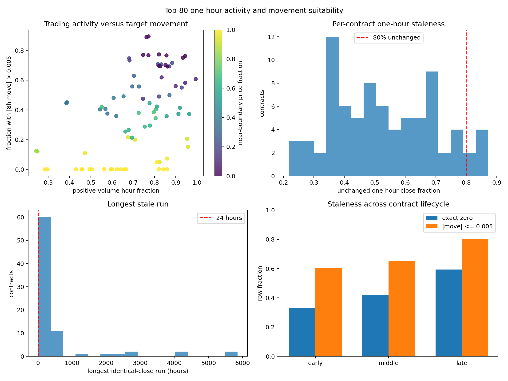

# Top-80 One-Hour Activity Suitability Audit

Status: exploratory data analysis only; no model training or selection.

The cohort uses the same retrospectively identified, early-prefix-ranked top-80 contract identities as the four-hour lifecycle analysis. Metrics use a 256-hour input eligibility rule and an eight-hour future probability-movement target.

## Aggregate findings

- Raw rows: `192658`; model-eligible rows: `171618`.
- Pooled exact-zero eight-hour targets: `46.23%`.
- Pooled stable targets (`|delta| <= 0.005`): `69.57%`.
- Pooled mean / median / p90 absolute eight-hour move: `0.006795` / `0.001000` / `0.020000`.
- Contracts with at least 80% unchanged one-hour closes: `6` / `80`.
- Contracts with fewer than 10% meaningful eight-hour moves: `20` / `80`.
- Contracts with a constant-close run of at least 24h / 72h: `51` / `33`.
- Contracts whose trailing constant-price tail occupies at least 25% of the file: `19` / `80`.
- Low-information composite contracts: `4` / `80`.
- Rank correlation between positive-volume fraction and meaningful-movement fraction: `0.4451`.

The low-information composite is an exploratory flag, not an exclusion rule: at least 80% unchanged one-hour closes and fewer than 10% of eligible eight-hour targets moving by more than 0.005.

## Causal activity-filter sensitivity

| eligibility | rows | retained_fraction | contracts | zero_move_fraction | stable_fraction | mean_absolute_move | median_absolute_move | p90_absolute_move |
| --- | --- | --- | --- | --- | --- | --- | --- | --- |
| all_rows | 171618 | 1 | 80 | 0.462288 | 0.695737 | 0.00679544 | 0.001 | 0.02 |
| recent_positive_volume_24h | 136885 | 0.797614 | 80 | 0.325916 | 0.618534 | 0.00851968 | 0.0017 | 0.02 |
| recent_price_change_72h | 133161 | 0.775915 | 80 | 0.307102 | 0.607866 | 0.00875788 | 0.002 | 0.02 |
| recent_price_change_24h | 130878 | 0.762612 | 80 | 0.296077 | 0.601209 | 0.00890714 | 0.002 | 0.02 |
| recent_change_and_volume_24h | 130876 | 0.762601 | 80 | 0.296074 | 0.601203 | 0.00890728 | 0.002 | 0.02 |

The recent-activity filters use only information available at each decision time. They are diagnostics, not yet frozen inclusion rules. Trailing-flat statistics are retrospective diagnostics and must not themselves be used as causal filters.

## Lifecycle distribution

| lifecycle_stage | rows | contracts | zero_move_fraction | stable_fraction | mean_absolute_move | median_absolute_move | p90_absolute_move | near_boundary_fraction |
| --- | --- | --- | --- | --- | --- | --- | --- | --- |
| early | 43825 | 80 | 0.331546 | 0.601141 | 0.00936596 | 0.001 | 0.0278 | 0.476851 |
| middle | 64179 | 80 | 0.420527 | 0.652051 | 0.00754395 | 0.001 | 0.02 | 0.567164 |
| late | 63614 | 80 | 0.594492 | 0.80498 | 0.0042694 | 0 | 0.01 | 0.793567 |

## Two-walk global-calendar evaluation distribution

| walk | eligibility | train_start | cutoff | evaluation_end | task_train_rows | task_train_contracts | rows | contracts | zero_move_fraction | stable_fraction | mean_absolute_move | median_absolute_move | p90_absolute_move | down_fraction | up_fraction |
| --- | --- | --- | --- | --- | --- | --- | --- | --- | --- | --- | --- | --- | --- | --- | --- |
| 1 | all_rows | 2024-06-28 20:00:00 | 2025-03-31 09:00:00 | 2025-08-16 04:00:00 | 118708 | 59 | 28592 | 20 | 0.642068 | 0.833135 | 0.00260641 | 0 | 0.01 | 0.0823307 | 0.0845341 |
| 1 | recent_price_change_24h | 2024-06-28 20:00:00 | 2025-03-31 09:00:00 | 2025-08-16 04:00:00 | 104629 | 59 | 12876 | 14 | 0.206431 | 0.629466 | 0.00578647 | 0.003 | 0.012 | 0.182821 | 0.187714 |
| 1 | recent_price_change_72h | 2024-06-28 20:00:00 | 2025-03-31 09:00:00 | 2025-08-16 04:00:00 | 106106 | 59 | 13328 | 14 | 0.232143 | 0.642032 | 0.00559143 | 0.003 | 0.012 | 0.176621 | 0.181348 |
| 1 | recent_change_and_volume_24h | 2024-06-28 20:00:00 | 2025-03-31 09:00:00 | 2025-08-16 04:00:00 | 104627 | 59 | 12876 | 14 | 0.206431 | 0.629466 | 0.00578647 | 0.003 | 0.012 | 0.182821 | 0.187714 |
| 2 | all_rows | 2024-11-13 15:00:00 | 2025-08-16 04:00:00 | 2025-12-31 23:00:00 | 119770 | 59 | 24134 | 15 | 0.570564 | 0.669139 | 0.00919577 | 0 | 0.0286 | 0.16802 | 0.162841 |
| 2 | recent_price_change_24h | 2024-11-13 15:00:00 | 2025-08-16 04:00:00 | 2025-12-31 23:00:00 | 90504 | 59 | 13278 | 13 | 0.219461 | 0.398629 | 0.0167142 | 0.01 | 0.04 | 0.305392 | 0.295978 |
| 2 | recent_price_change_72h | 2024-11-13 15:00:00 | 2025-08-16 04:00:00 | 2025-12-31 23:00:00 | 92324 | 59 | 13617 | 13 | 0.238893 | 0.413601 | 0.0162981 | 0.01 | 0.04 | 0.29779 | 0.28861 |
| 2 | recent_change_and_volume_24h | 2024-11-13 15:00:00 | 2025-08-16 04:00:00 | 2025-12-31 23:00:00 | 90502 | 59 | 13278 | 13 | 0.219461 | 0.398629 | 0.0167142 | 0.01 | 0.04 | 0.305392 | 0.295978 |

## Ten stalest contracts by one-hour close

| contract_rank | filename | raw_rows | positive_volume_fraction | one_hour_zero_move_fraction | eight_hour_meaningful_005_fraction | longest_constant_close_run_hours | trailing_constant_close_run_hours | trailing_constant_close_fraction |
| --- | --- | --- | --- | --- | --- | --- | --- | --- |
| 50 | WillYoungBoysWinTheUefaChampionsLYES20240917_USDC-1h.feather | 6140 | 0.296743 | 0.872292 | 0 | 4095 | 4095 | 0.666938 |
| 76 | WillYoungBoysWinTheUefaChampionsLNO20240917_USDC-1h.feather | 6140 | 0.282899 | 0.870337 | 0 | 4095 | 4095 | 0.666938 |
| 20 | WillCLinGeorgescuWinTheRomanianPrYES20250117_USDC-1h.feather | 8344 | 0.249161 | 0.837708 | 0.120653 | 5853 | 5853 | 0.701462 |
| 21 | WillCLinGeorgescuWinTheRomanianPrNO20250117_USDC-1h.feather | 8344 | 0.243408 | 0.835311 | 0.124118 | 5841 | 5841 | 0.700024 |
| 38 | WillDinamoZagrebWinTheUefaChampionYES20240917_USDC-1h.feather | 6140 | 0.457166 | 0.803388 | 0 | 2919 | 2919 | 0.475407 |
| 72 | WillDinamoZagrebWinTheUefaChampionNO20240917_USDC-1h.feather | 6140 | 0.430945 | 0.803225 | 0.000170155 | 2919 | 2919 | 0.475407 |
| 60 | WillStadeBrestoisWinTheUefaChampioYES20240917_USDC-1h.feather | 6140 | 0.505863 | 0.77081 | 0 | 2423 | 2423 | 0.394625 |
| 33 | WillJanVanAkenBeTheNextChancellorYES20241216_USDC-1h.feather | 1649 | 0.600364 | 0.763956 | 0 | 507 | 507 | 0.307459 |
| 78 | WillJoeBidenBeDNomForVpOnElectiYES20240809_USDC-1h.feather | 2081 | 0.593945 | 0.762019 | 0 | 558 | 558 | 0.26814 |
| 41 | WillClubBruggeWinTheUefaChampionsYES20240917_USDC-1h.feather | 6140 | 0.563192 | 0.751914 | 0.00136124 | 2103 | 2103 | 0.342508 |

Large row counts do not by themselves establish learnability. The target variance, contract coverage, lifecycle composition, and performance against an exact-zero movement baseline must all be reported in later Phase 4 experiments.
