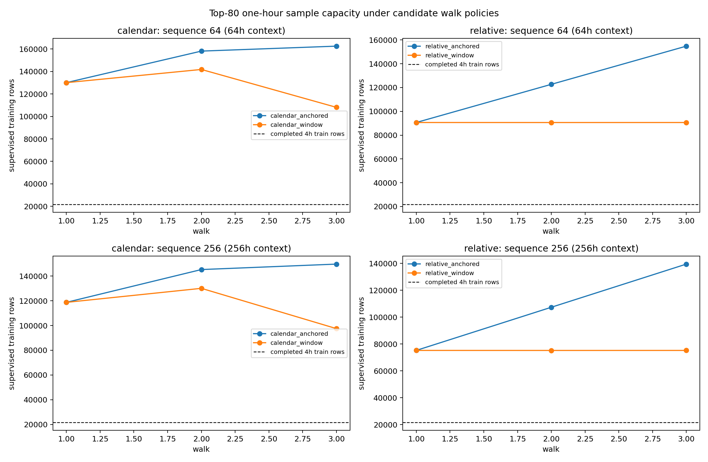

# Top-80 One-Hour Timestamp and Training-Capacity Audit

Status: data analysis only; no model training or Phase 4 bundle generation.

## Timestamp audit

| contracts | total_rows | minimum_rows | median_rows | maximum_rows | earliest_timestamp | latest_timestamp | strictly_increasing_contracts | duplicate_timestamps | non_hour_aligned_timestamps | non_1h_steps | missing_or_nonfinite_ohlcv_cells |
| --- | --- | --- | --- | --- | --- | --- | --- | --- | --- | --- | --- |
| 80 | 192658 | 1286 | 1649 | 8344 | 2024-06-28 20:00:00 | 2026-01-01 05:00:00 | 80 | 0 | 0 | 0 | 0 |

The same 80 contract identities used by the four-hour analysis all have matching one-hour feather files. The `date` field is checked contract by contract for type, ordering, duplicates, hourly alignment, and step regularity.

## Three-walk capacity focus

| sequence_length | scheme | walk | task_train_rows | task_train_contracts | task_train_rows_per_contract_median | evaluation_rows | evaluation_contracts | task_train_to_phase3_4h_ratio |
| --- | --- | --- | --- | --- | --- | --- | --- | --- |
| 64 | calendar_window | 1 | 130036 | 59 | 1580 | 27924 | 20 | 5.99355 |
| 64 | calendar_window | 2 | 141766 | 61 | 1578 | 4392 | 2 | 6.5342 |
| 64 | calendar_window | 3 | 108071 | 55 | 1364 | 24426 | 15 | 4.98115 |
| 64 | relative_window | 1 | 90622 | 80 | 753 | 31462 | 80 | 4.1769 |
| 64 | relative_window | 2 | 90601 | 80 | 753 | 31475 | 80 | 4.17593 |
| 64 | relative_window | 3 | 90614 | 80 | 753 | 31419 | 80 | 4.17653 |
| 256 | calendar_window | 1 | 118708 | 59 | 1388 | 26388 | 20 | 5.47142 |
| 256 | calendar_window | 2 | 130054 | 61 | 1386 | 4392 | 2 | 5.99438 |
| 256 | calendar_window | 3 | 97511 | 55 | 1172 | 21930 | 15 | 4.49442 |
| 256 | relative_window | 1 | 75262 | 80 | 561 | 31462 | 80 | 3.46893 |
| 256 | relative_window | 2 | 75241 | 80 | 561 | 31475 | 80 | 3.46797 |
| 256 | relative_window | 3 | 75254 | 80 | 561 | 31419 | 80 | 3.46857 |

The ratio uses `21696` rows as the reference workload from the completed Phase 3 four-hour encoder bundle. It is a scale comparison, not a proof that two datasets have equal information content.

Sequence length 64 gives 64 hours of one-hour context. Sequence length 256 preserves the 256-hour duration of the existing four-hour, length-64 inputs. Both are reported because comparing only sequence length 64 would silently change the temporal context.

Contract-relative rows are retrospective lifecycle evidence. Calendar rows establish raw capacity for a deployable split, but the top-80 cohort itself remains retrospective until a cutoff-local universe rule is frozen.

