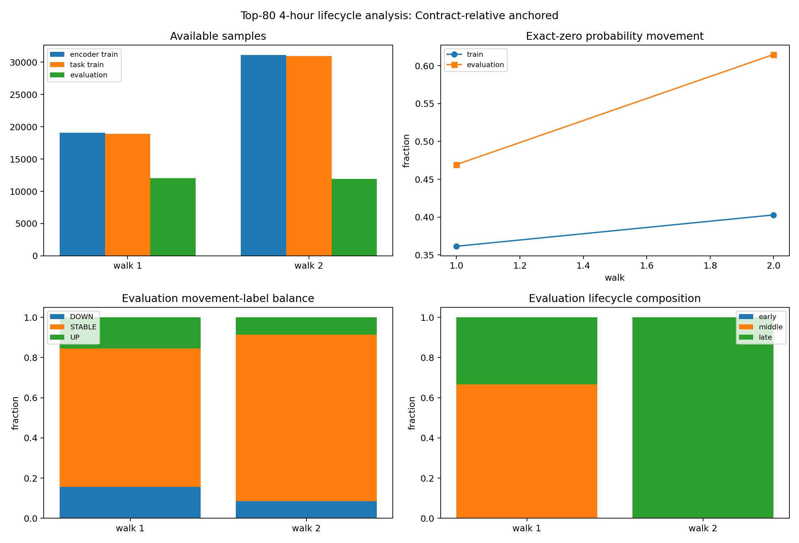

# Phase 4 Top-80 Walk Data Analysis — `relative_anchored`

Status: exploratory data feasibility analysis; no model was trained.

## Contract

- Timeframe: `4h`
- Sequence length: `64`
- Horizon: `2` steps (`8` hours)
- Label threshold: `0.005` probability points
- Contracts: `80` retrospective prefix-ranked contracts
- Contract-relative walk scheme: `relative_anchored`

The top-80 cohort is reused from the Phase 3 per-contract 256-row prefix ranking. Every boundary is a fraction of each contract's own observed length. This is a retrospective lifecycle analysis, not a causally deployable pooled-model split: relative cutoffs map to different calendar dates and observed final length is future information unless the termination boundary was known at decision time.

## Walk sample availability

| scheme | walk | train_start_fraction | cutoff_fraction | evaluation_end_fraction | encoder_train_rows | task_train_rows | evaluation_rows | encoder_train_contracts | task_train_contracts | evaluation_contracts | task_train_contracts_ge_64_rows | task_train_contracts_ge_256_rows | evaluation_contracts_ge_16_rows | task_train_rows_median_per_active_contract | evaluation_rows_median_per_active_contract | immature_rows_excluded_from_task_train |
| --- | --- | --- | --- | --- | --- | --- | --- | --- | --- | --- | --- | --- | --- | --- | --- | --- |
| relative_anchored | 1 | 0 | 0.5 | 0.75 | 19060 | 18900 | 12057 | 80 | 80 | 80 | 80 | 22 | 80 | 141 | 103 | 160 |
| relative_anchored | 2 | 0 | 0.75 | 1 | 31117 | 30957 | 11929 | 80 | 80 | 80 | 80 | 34 | 80 | 244 | 102 | 160 |

## Probability movement and return diagnostics

| scheme | walk | partition | rows | contracts | identity_sha256 | probability_movement_sha256 | probability_movement_mean | probability_movement_std | zero_movement_fraction | stable_tau005_fraction | zero_baseline_mae | zero_baseline_rmse | abs_movement_q50 | abs_movement_q90 | abs_movement_q95 | abs_movement_q99 | return_defined_rows | return_undefined_zero_price_rows | return_defined_fraction | arithmetic_return_median | absolute_return_q50 | absolute_return_q90 | absolute_return_q95 | absolute_return_q99 | absolute_return_gt_1_fraction | absolute_return_gt_10_fraction | near_boundary_fraction |
| --- | --- | --- | --- | --- | --- | --- | --- | --- | --- | --- | --- | --- | --- | --- | --- | --- | --- | --- | --- | --- | --- | --- | --- | --- | --- | --- | --- |
| relative_anchored | 1 | train | 18900 | 80 | 81447a1a96be540e5308e4d9f10d871fdab6c461da9de63550428bb62766a441 | b93e6ee5c3fedbce7555150ddb22d079a106ed5efa1aebcb7015af32f8e77001 | -5.9582e-05 | 0.0204525 | 0.361481 | 0.612698 | 0.00887221 | 0.0204526 | 0.001 | 0.02113 | 0.04 | 0.087 | 18900 | 0 | 1 | 0 | 0.0114943 | 0.2 | 0.333333 | 0.512679 | 0.00174603 | 0.00015873 | 0.37328 |
| relative_anchored | 1 | evaluation | 12057 | 80 | 84dee8a100d9e1b98afc59086ef3d19e6e5fd277e5a74820b841e6642591d43e | f4449c3c88b2caea78df91026fc4bb3ea1572e1b189e5b87d52e3ca07d24a145 | -5.42009e-05 | 0.0182606 | 0.469437 | 0.690139 | 0.00666379 | 0.0182607 | 0.001 | 0.02 | 0.03 | 0.069888 | 12057 | 0 | 1 | 0 | 0.00102459 | 0.2 | 0.333333 | 1 | 0.00306876 | 0 | 0.451439 |
| relative_anchored | 2 | train | 30957 | 80 | 9e09854e489f06b6b92a6b8774190a80e0b382656edfead35b1ba71797f6ae83 | f466c3629008cb3de266d57b71b8e2571f593dd0d83fec63c7621fb7d3753bd5 | -4.78083e-05 | 0.019617 | 0.402881 | 0.642601 | 0.00801289 | 0.019617 | 0.001 | 0.02 | 0.0341 | 0.08 | 30957 | 0 | 1 | 0 | 0.00518672 | 0.2 | 0.333333 | 0.666667 | 0.0022935 | 9.69086e-05 | 0.403011 |
| relative_anchored | 2 | evaluation | 11929 | 80 | 05eceecc4b856d3e9600deb3468f073fa9eefa87464538ac3cc0bad8f54d5913 | 33f554805669299de10daf6ee4c7eea90a117c65c0703039e5076aa8806d5881 | 1.80149e-05 | 0.0144585 | 0.614804 | 0.829323 | 0.00392369 | 0.0144586 | 0 | 0.01 | 0.02 | 0.06 | 11929 | 0 | 1 | 0 | 0 | 0.152605 | 0.333333 | 1 | 0.00385615 | 0 | 0.636432 |

Arithmetic return is defined as `(future_close - current_close) / current_close`. Rows with current close equal to zero are retained for probability movement but reported as undefined for arithmetic return.

## DOWN/STABLE/UP label distribution

| scheme | walk | partition | class | rows | fraction |
| --- | --- | --- | --- | --- | --- |
| relative_anchored | 1 | train | DOWN | 3636 | 0.192381 |
| relative_anchored | 1 | train | STABLE | 11580 | 0.612698 |
| relative_anchored | 1 | train | UP | 3684 | 0.194921 |
| relative_anchored | 1 | evaluation | DOWN | 1871 | 0.15518 |
| relative_anchored | 1 | evaluation | STABLE | 8321 | 0.690139 |
| relative_anchored | 1 | evaluation | UP | 1865 | 0.154682 |
| relative_anchored | 2 | train | DOWN | 5504 | 0.177795 |
| relative_anchored | 2 | train | STABLE | 19893 | 0.642601 |
| relative_anchored | 2 | train | UP | 5560 | 0.179604 |
| relative_anchored | 2 | evaluation | DOWN | 1012 | 0.0848353 |
| relative_anchored | 2 | evaluation | STABLE | 9893 | 0.829323 |
| relative_anchored | 2 | evaluation | UP | 1024 | 0.0858412 |

Training rows require the complete 64-step input window to lie inside the walk's relative training interval and require the target position to be strictly before the relative cutoff. The analysis does not make a no-future-leak deployment claim.

