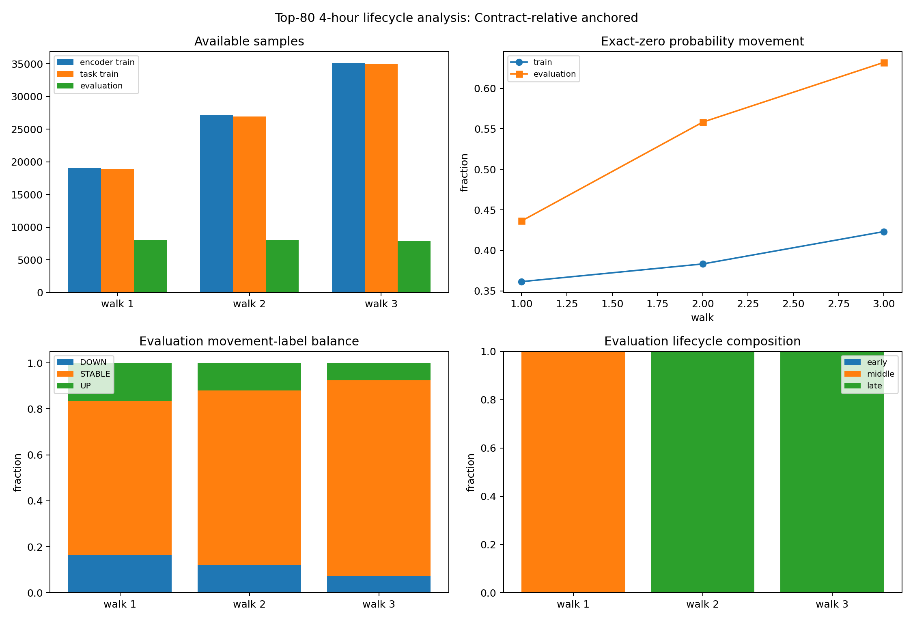

# Phase 4 Top-80 Walk Data Analysis — `relative_anchored`

Status: exploratory data feasibility analysis; no model was trained.

## Contract

- Timeframe: `4h`
- Sequence length: `64`
- Horizon: `2` steps (`8` hours)
- Label threshold: `0.005` probability points
- Contracts: `80` retrospective prefix-ranked contracts
- Contract-relative walk scheme: `relative_anchored`

The top-80 cohort is reused from the Phase 3 per-contract 256-row prefix ranking. Every boundary is a fraction of each contract's own observed length. This is a retrospective lifecycle analysis, not a causally deployable pooled-model split: relative cutoffs map to different calendar dates and observed final length is future information unless the termination boundary was known at decision time.

## Walk sample availability

| scheme | walk | train_start_fraction | cutoff_fraction | evaluation_end_fraction | encoder_train_rows | task_train_rows | evaluation_rows | encoder_train_contracts | task_train_contracts | evaluation_contracts | task_train_contracts_ge_64_rows | task_train_contracts_ge_256_rows | evaluation_contracts_ge_16_rows | task_train_rows_median_per_active_contract | evaluation_rows_median_per_active_contract | immature_rows_excluded_from_task_train |
| --- | --- | --- | --- | --- | --- | --- | --- | --- | --- | --- | --- | --- | --- | --- | --- | --- |
| relative_anchored | 1 | 0 | 0.5 | 0.666667 | 19060 | 18900 | 8041 | 80 | 80 | 80 | 80 | 22 | 80 | 141 | 69 | 160 |
| relative_anchored | 2 | 0 | 0.666667 | 0.833333 | 27101 | 26941 | 8044 | 80 | 80 | 80 | 80 | 26 | 80 | 210 | 69 | 160 |
| relative_anchored | 3 | 0 | 0.833333 | 1 | 35145 | 34985 | 7901 | 80 | 80 | 80 | 80 | 57 | 80 | 279 | 67 | 160 |

## Probability movement and return diagnostics

| scheme | walk | partition | rows | contracts | identity_sha256 | probability_movement_sha256 | probability_movement_mean | probability_movement_std | zero_movement_fraction | stable_tau005_fraction | zero_baseline_mae | zero_baseline_rmse | abs_movement_q50 | abs_movement_q90 | abs_movement_q95 | abs_movement_q99 | return_defined_rows | return_undefined_zero_price_rows | return_defined_fraction | arithmetic_return_median | absolute_return_q50 | absolute_return_q90 | absolute_return_q95 | absolute_return_q99 | absolute_return_gt_1_fraction | absolute_return_gt_10_fraction | near_boundary_fraction |
| --- | --- | --- | --- | --- | --- | --- | --- | --- | --- | --- | --- | --- | --- | --- | --- | --- | --- | --- | --- | --- | --- | --- | --- | --- | --- | --- | --- |
| relative_anchored | 1 | train | 18900 | 80 | 81447a1a96be540e5308e4d9f10d871fdab6c461da9de63550428bb62766a441 | b93e6ee5c3fedbce7555150ddb22d079a106ed5efa1aebcb7015af32f8e77001 | -5.9582e-05 | 0.0204525 | 0.361481 | 0.612698 | 0.00887221 | 0.0204526 | 0.001 | 0.02113 | 0.04 | 0.087 | 18900 | 0 | 1 | 0 | 0.0114943 | 0.2 | 0.333333 | 0.512679 | 0.00174603 | 0.00015873 | 0.37328 |
| relative_anchored | 1 | evaluation | 8041 | 80 | 9a4980a566e43d426a4159fe89e304c988d53db3381c43518733c330d9745186 | f16a4897ea48853eea702222ffd924697c12b6bacc8a563c1c6f3fe360d38ba3 | -6.7616e-05 | 0.0195421 | 0.436389 | 0.669195 | 0.00730037 | 0.0195422 | 0.001 | 0.02 | 0.03 | 0.07 | 8041 | 0 | 1 | 0 | 0.00302725 | 0.21 | 0.333333 | 0.833333 | 0.00310907 | 0 | 0.424698 |
| relative_anchored | 2 | train | 26941 | 80 | dd5a170f13bf4dec0612293bbb898d17b2712c2f3e1c6dadd6ff97dd5d04cec2 | 8ca20ea87ad57cdd2d94d5908f023d16ca623718609c5e534fecc1ee1cd1891b | -5.65087e-05 | 0.0201857 | 0.383319 | 0.628781 | 0.00841099 | 0.0201858 | 0.001 | 0.02 | 0.0392 | 0.08 | 26941 | 0 | 1 | 0 | 0.00990099 | 0.2 | 0.333333 | 0.666667 | 0.00218997 | 0.000111354 | 0.38807 |
| relative_anchored | 2 | evaluation | 8044 | 80 | 6dbf2c474367223af1f8d39b85965aa2b30db586360ff8aa619dde56a1e1fd17 | 189fa4e38160e62f9a0f3f230222342737afd18b81333d127d6d8d4e848bb258 | -1.87469e-05 | 0.0139283 | 0.558304 | 0.759572 | 0.00478056 | 0.0139283 | 0 | 0.0102 | 0.02 | 0.06 | 8044 | 0 | 1 | 0 | 0 | 0.166667 | 0.333333 | 1 | 0.00298359 | 0 | 0.536176 |
| relative_anchored | 3 | train | 34985 | 80 | a6fdedc7055af3f58165d1be0c72c72bffbcb17a72d0da7a0bad4716d5f295a6 | dc64aace6aa92007dbd329aa413323b6b5901090996ba495cead4c945b98b420 | -4.70459e-05 | 0.0189326 | 0.423267 | 0.658825 | 0.00758061 | 0.0189326 | 0.001 | 0.02 | 0.03 | 0.077448 | 34985 | 0 | 1 | 0 | 0.00307692 | 0.2 | 0.333333 | 0.6875 | 0.00234386 | 8.5751e-05 | 0.421495 |
| relative_anchored | 3 | evaluation | 7901 | 80 | 3421043add70dd00e10d93c414395147f3c034f8a59430aa2c5e3df19c9c4824 | 14669f00b987f1945d8f6c976151032bbbebefca1417f03e37d8ae7e2f28aece | 3.23883e-05 | 0.015437 | 0.632072 | 0.850905 | 0.00379622 | 0.0154371 | 0 | 0.01 | 0.02 | 0.06 | 7901 | 0 | 1 | 0 | 0 | 0.148148 | 0.333333 | 1 | 0.00430325 | 0 | 0.671687 |

Arithmetic return is defined as `(future_close - current_close) / current_close`. Rows with current close equal to zero are retained for probability movement but reported as undefined for arithmetic return.

## DOWN/STABLE/UP label distribution

| scheme | walk | partition | class | rows | fraction |
| --- | --- | --- | --- | --- | --- |
| relative_anchored | 1 | train | DOWN | 3636 | 0.192381 |
| relative_anchored | 1 | train | STABLE | 11580 | 0.612698 |
| relative_anchored | 1 | train | UP | 3684 | 0.194921 |
| relative_anchored | 1 | evaluation | DOWN | 1327 | 0.165029 |
| relative_anchored | 1 | evaluation | STABLE | 5381 | 0.669195 |
| relative_anchored | 1 | evaluation | UP | 1333 | 0.165775 |
| relative_anchored | 2 | train | DOWN | 4972 | 0.184551 |
| relative_anchored | 2 | train | STABLE | 16940 | 0.628781 |
| relative_anchored | 2 | train | UP | 5029 | 0.186667 |
| relative_anchored | 2 | evaluation | DOWN | 977 | 0.121457 |
| relative_anchored | 2 | evaluation | STABLE | 6110 | 0.759572 |
| relative_anchored | 2 | evaluation | UP | 957 | 0.118971 |
| relative_anchored | 3 | train | DOWN | 5948 | 0.170016 |
| relative_anchored | 3 | train | STABLE | 23049 | 0.658825 |
| relative_anchored | 3 | train | UP | 5988 | 0.171159 |
| relative_anchored | 3 | evaluation | DOWN | 579 | 0.0732819 |
| relative_anchored | 3 | evaluation | STABLE | 6723 | 0.850905 |
| relative_anchored | 3 | evaluation | UP | 599 | 0.0758132 |

Training rows require the complete 64-step input window to lie inside the walk's relative training interval and require the target position to be strictly before the relative cutoff. The analysis does not make a no-future-leak deployment claim.

