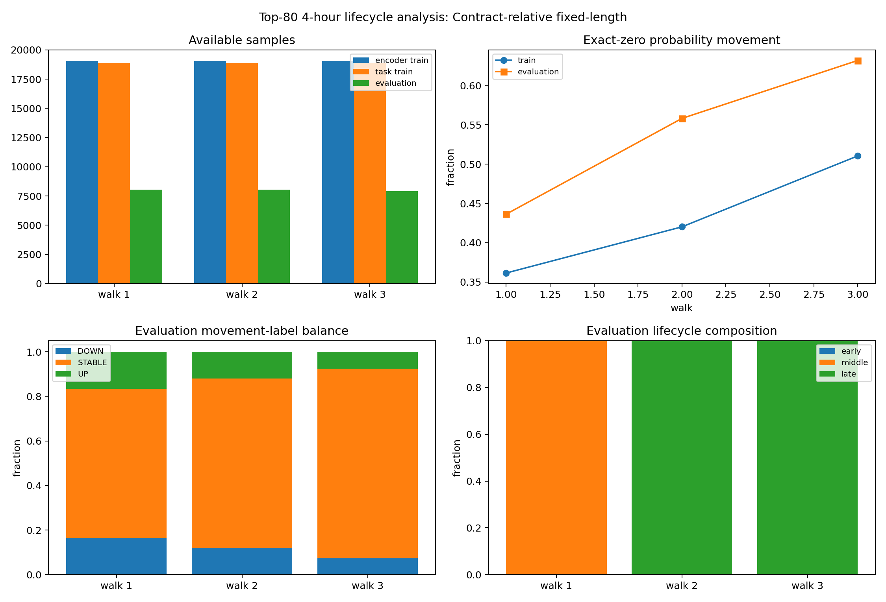

# Phase 4 Top-80 Walk Data Analysis — `relative_window`

Status: exploratory data feasibility analysis; no model was trained.

## Contract

- Timeframe: `4h`
- Sequence length: `64`
- Horizon: `2` steps (`8` hours)
- Label threshold: `0.005` probability points
- Contracts: `80` retrospective prefix-ranked contracts
- Contract-relative walk scheme: `relative_window`

The top-80 cohort is reused from the Phase 3 per-contract 256-row prefix ranking. Every boundary is a fraction of each contract's own observed length. This is a retrospective lifecycle analysis, not a causally deployable pooled-model split: relative cutoffs map to different calendar dates and observed final length is future information unless the termination boundary was known at decision time.

## Walk sample availability

| scheme | walk | train_start_fraction | cutoff_fraction | evaluation_end_fraction | encoder_train_rows | task_train_rows | evaluation_rows | encoder_train_contracts | task_train_contracts | evaluation_contracts | task_train_contracts_ge_64_rows | task_train_contracts_ge_256_rows | evaluation_contracts_ge_16_rows | task_train_rows_median_per_active_contract | evaluation_rows_median_per_active_contract | immature_rows_excluded_from_task_train |
| --- | --- | --- | --- | --- | --- | --- | --- | --- | --- | --- | --- | --- | --- | --- | --- | --- |
| relative_window | 1 | 0 | 0.5 | 0.666667 | 19060 | 18900 | 8041 | 80 | 80 | 80 | 80 | 22 | 80 | 141 | 69 | 160 |
| relative_window | 2 | 0.166667 | 0.666667 | 0.833333 | 19050 | 18890 | 8044 | 80 | 80 | 80 | 80 | 22 | 80 | 141 | 69 | 160 |
| relative_window | 3 | 0.333333 | 0.833333 | 1 | 19053 | 18893 | 7901 | 80 | 80 | 80 | 80 | 22 | 80 | 141 | 67 | 160 |

## Probability movement and return diagnostics

| scheme | walk | partition | rows | contracts | identity_sha256 | probability_movement_sha256 | probability_movement_mean | probability_movement_std | zero_movement_fraction | stable_tau005_fraction | zero_baseline_mae | zero_baseline_rmse | abs_movement_q50 | abs_movement_q90 | abs_movement_q95 | abs_movement_q99 | return_defined_rows | return_undefined_zero_price_rows | return_defined_fraction | arithmetic_return_median | absolute_return_q50 | absolute_return_q90 | absolute_return_q95 | absolute_return_q99 | absolute_return_gt_1_fraction | absolute_return_gt_10_fraction | near_boundary_fraction |
| --- | --- | --- | --- | --- | --- | --- | --- | --- | --- | --- | --- | --- | --- | --- | --- | --- | --- | --- | --- | --- | --- | --- | --- | --- | --- | --- | --- |
| relative_window | 1 | train | 18900 | 80 | 81447a1a96be540e5308e4d9f10d871fdab6c461da9de63550428bb62766a441 | b93e6ee5c3fedbce7555150ddb22d079a106ed5efa1aebcb7015af32f8e77001 | -5.9582e-05 | 0.0204525 | 0.361481 | 0.612698 | 0.00887221 | 0.0204526 | 0.001 | 0.02113 | 0.04 | 0.087 | 18900 | 0 | 1 | 0 | 0.0114943 | 0.2 | 0.333333 | 0.512679 | 0.00174603 | 0.00015873 | 0.37328 |
| relative_window | 1 | evaluation | 8041 | 80 | 9a4980a566e43d426a4159fe89e304c988d53db3381c43518733c330d9745186 | f16a4897ea48853eea702222ffd924697c12b6bacc8a563c1c6f3fe360d38ba3 | -6.7616e-05 | 0.0195421 | 0.436389 | 0.669195 | 0.00730037 | 0.0195422 | 0.001 | 0.02 | 0.03 | 0.07 | 8041 | 0 | 1 | 0 | 0.00302725 | 0.21 | 0.333333 | 0.833333 | 0.00310907 | 0 | 0.424698 |
| relative_window | 2 | train | 18890 | 80 | 6041664ebd46218bdd432a3a6a9a99fd355a071a538d0cfaed3e9bd0cb3fb335 | da44d0f4ad01bc07274c405d1e6b30dff00d572809e9a820799f2acf864940e3 | -6.68819e-05 | 0.0183948 | 0.420275 | 0.664849 | 0.00743194 | 0.0183949 | 0.001 | 0.02 | 0.03 | 0.072911 | 18890 | 0 | 1 | 0 | 0.00322581 | 0.2 | 0.32 | 0.666667 | 0.00238221 | 0.000158814 | 0.428957 |
| relative_window | 2 | evaluation | 8044 | 80 | 6dbf2c474367223af1f8d39b85965aa2b30db586360ff8aa619dde56a1e1fd17 | 189fa4e38160e62f9a0f3f230222342737afd18b81333d127d6d8d4e848bb258 | -1.87469e-05 | 0.0139283 | 0.558304 | 0.759572 | 0.00478056 | 0.0139283 | 0 | 0.0102 | 0.02 | 0.06 | 8044 | 0 | 1 | 0 | 0 | 0.166667 | 0.333333 | 1 | 0.00298359 | 0 | 0.536176 |
| relative_window | 3 | train | 18893 | 80 | dc851af1997166b047f8c9fe174f3a77bceed707ca759fab640fed8826e58253 | 95bc98d69e75c8170ab50af910b600dbb5bec04b8b00371382ad915e7b18efce | -1.23114e-05 | 0.0167781 | 0.510559 | 0.724766 | 0.00591126 | 0.0167781 | 0 | 0.01998 | 0.03 | 0.066968 | 18893 | 0 | 1 | 0 | 0 | 0.2 | 0.333333 | 0.929841 | 0.00275234 | 0 | 0.499762 |
| relative_window | 3 | evaluation | 7901 | 80 | 3421043add70dd00e10d93c414395147f3c034f8a59430aa2c5e3df19c9c4824 | 14669f00b987f1945d8f6c976151032bbbebefca1417f03e37d8ae7e2f28aece | 3.23883e-05 | 0.015437 | 0.632072 | 0.850905 | 0.00379622 | 0.0154371 | 0 | 0.01 | 0.02 | 0.06 | 7901 | 0 | 1 | 0 | 0 | 0.148148 | 0.333333 | 1 | 0.00430325 | 0 | 0.671687 |

Arithmetic return is defined as `(future_close - current_close) / current_close`. Rows with current close equal to zero are retained for probability movement but reported as undefined for arithmetic return.

## DOWN/STABLE/UP label distribution

| scheme | walk | partition | class | rows | fraction |
| --- | --- | --- | --- | --- | --- |
| relative_window | 1 | train | DOWN | 3636 | 0.192381 |
| relative_window | 1 | train | STABLE | 11580 | 0.612698 |
| relative_window | 1 | train | UP | 3684 | 0.194921 |
| relative_window | 1 | evaluation | DOWN | 1327 | 0.165029 |
| relative_window | 1 | evaluation | STABLE | 5381 | 0.669195 |
| relative_window | 1 | evaluation | UP | 1333 | 0.165775 |
| relative_window | 2 | train | DOWN | 3151 | 0.166808 |
| relative_window | 2 | train | STABLE | 12559 | 0.664849 |
| relative_window | 2 | train | UP | 3180 | 0.168343 |
| relative_window | 2 | evaluation | DOWN | 977 | 0.121457 |
| relative_window | 2 | evaluation | STABLE | 6110 | 0.759572 |
| relative_window | 2 | evaluation | UP | 957 | 0.118971 |
| relative_window | 3 | train | DOWN | 2598 | 0.137511 |
| relative_window | 3 | train | STABLE | 13693 | 0.724766 |
| relative_window | 3 | train | UP | 2602 | 0.137723 |
| relative_window | 3 | evaluation | DOWN | 579 | 0.0732819 |
| relative_window | 3 | evaluation | STABLE | 6723 | 0.850905 |
| relative_window | 3 | evaluation | UP | 599 | 0.0758132 |

Training rows require the complete 64-step input window to lie inside the walk's relative training interval and require the target position to be strictly before the relative cutoff. The analysis does not make a no-future-leak deployment claim.

