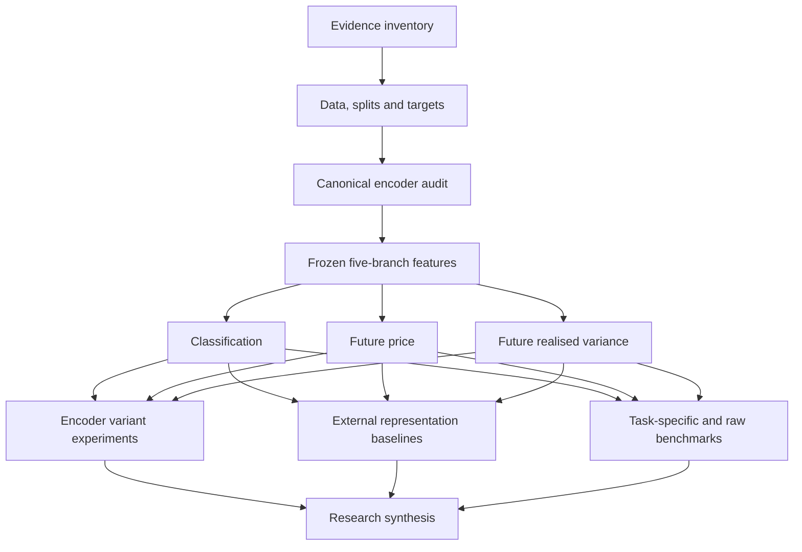

# Lumid research audit demonstration plan

**Date:** 2026-10-10

**Status:** Implemented; local DAG and built-image verification pass. On 2026-10-10, the owner reported that all 19 stages passed on FlowMesh and supplied the combined DAG screenshot. Platform result artifacts have not yet been independently inspected.

**Scope:** One FlowMesh DAG demonstrating the completed Phase 5, 6, 6.5,
6.7, and 6.9 research evidence across both global-calendar walks.

## Purpose

Build one workflow that explains and audits the research from data contracts
through canonical representations, downstream tasks, encoder variants, and
baseline comparisons. Reuse completed experiment artifacts. The demonstration
runs evidence verification and reporting; it does not repeat training.

Keep encoder variant experiments visible as a separate major stage. Their
substitution, complementarity, and capacity questions are distinct from
checking that an encoder checkpoint or feature store exists. Include Phase 6.9
in the task-specific benchmark group even though it was not part of the
original workflow exploration.

This plan changes platform presentation and audit orchestration only. Existing
phase plans remain the scientific and artifact authorities. Optional Phase
6.8, deferred Phase 6.6, unimplemented Phase 7A, and deferred Phase 7B remain
outside executable demonstration scope. Historical Phase 1--3 and XM-MV8
results may appear as clearly labelled context in the final report.

## Platform support and implementation boundary

The original local platform references are:

- [Lumid workflow guide, section 15](</mnt/e/School-Work-6-Y3S2/FYP/Lumid_guides/lumid_workflow_guide.md:650>).
- [FlowMesh container platform guide](</mnt/e/School-Work-6-Y3S2/FYP/Lumid_guides/lumid-flowmesh-work-container-platform-guide.md>).

The workflow guide documents a DAG through `spec.graph.nodes[]`, connected
Python-node inputs and artifacts, declared metrics returned under `metrics`,
and recognition of the alternative `spec.stages` form. Missing declared
metrics cause a Python step to fail. Each Python node runs in its own worker
container.

Use one `flowmesh/v1` YAML, named
`flowmesh_research_audit.yaml`. Prefer the documented graph form, subject to
current platform schema validation. Prove the exact node/dependency syntax,
artifact handoff, and metric collection with a minimal two-node graph first.
The guides establish DAG support but are not a complete executable schema.

The six major stages below are conceptual presentation groups. Native nested
or collapsible groups have not been verified. Node names and descriptions
must remain understandable on a flat canvas. Each node covers both walks and
returns separate walk results; do not multiply nodes by walk or checkpoint.

## Stages and substages

The implemented graph contains 19 executable nodes. The six major stages
remain presentation groups; the YAML uses a flat graph with explicit dependencies.

| Major stage | Proposed nodes | Audit purpose |
|---|---|---|
| 1. Evidence and data contract | `evidence_inventory`, `data_contract` | Freeze the demonstration bundle; inspect source, split, preprocessing, row-population, and target evidence. |
| 2. Canonical framework | `canonical_encoders`, `canonical_features`, `classification`, `future_price`, `realised_variance` | Inspect the six canonical encoder trajectories, five-branch features, train-only scaling, and H0 results on the three current tasks. |
| 3. Encoder variant experiments | `temporal_variants`, `lstm_capacity`, `residual_cnn` | Audit controlled substitutions, additions, duplicate-width controls, capacity extensions, CKA, and resources. |
| 4. External representation baselines | `saurl_frozen`, `lwa_frozen`, `timedart_frozen` | Audit each method's recorded pretraining, frozen-feature, common-probe, and matched H0 comparison evidence. |
| 5. Task-specific and raw benchmarks | `raw_baselines`, `ta_mlp`, `sgn_c`, `xm_c8`, `garch_lstm` | Audit direct supervised, handcrafted-feature, and hybrid comparisons on their appropriate tasks and populations. |
| 6. Research synthesis | `research_synthesis` | Join audit results, display task-separated scientific results, and persist the final evidence report. |

### Stage 1: Evidence and data contract

`evidence_inventory` identifies the source revision, schema version, bundle
identity, expected methods, tasks, walks, snapshots, and allowed artifact
files. Verify packaged files against a frozen hash manifest.

`data_contract` inspects the accepted clean native one-hour cohort evidence:
two walk intervals, 64-hour contexts, isolated-one-hour filling and longer-gap
sequence breaks, observed endpoints, causal activity, target maturity, and
train-only fitted preprocessing. Preserve the accepted retrospective cohort
selection and approved offline-cleaning assumptions; quarantine-availability
replay is not a new requirement.

Record the current task definitions separately:

- Movement classification: h2, `tau=0.001`, original task rows.
- Future price: one `close[t+8h]` endpoint on the original price rows.
- Future realised variance: the strict observed eight-hour interval, with
  raw-unit reporting and the training-only horizon-freeze evidence.

Different tasks have different populations. Matching is required within a
task, walk, and comparison protocol, not across unrelated tasks.

### Stage 2: Canonical framework

Audit the recorded six walk-specific VAE, contrastive-CNN, and BYOL-CNN
trajectories, retained 5/15/50 snapshots, and encoder health diagnostics.

Inspect canonical feature provenance and the 445-dimensional concat contract:
statistical 70, transformed 55, VAE 64, contrastive CNN 128, and BYOL CNN 128.
Inspect task-row alignment and train-only feature scaling evidence.

Give classification, future price, and realised variance separate nodes. Each
returns the two H0 walk results, population identifiers, relevant non-learned
references, recorded replay status, and source links.

### Stage 3: Encoder variant experiments

`temporal_variants` covers the Phase 6 matrix:

- Four fixed-width LSTM/Transformer substitutions.
- Four heterogeneous single-branch additions.
- Two matching exact-duplicate CNN width controls.
- H0 as the immutable reference: 11 configurations, three tasks, two walks,
  yielding 66 entries, including 60 new downstream trajectories.
- Complete paired differences, centered linear CKA, encoder health, and
  resource measurements.

`lstm_capacity` covers Phase 6.5A's two-layer LSTM candidates under both SSL
families. Compare with the same-family one-layer predecessors; retain H0 and
duplicate-control context, all three tasks, CKA, and resources.

`residual_cnn` covers Phase 6.5D's residual-CNN substitutions and additions
under Contrastive and BYOL, with same-family duplicate-width controls. Its
executed scope is future price only.

Present substitution and complementarity separately. CKA is a similarity
diagnostic, not proof of predictive usefulness. Metric-wise best-observed
envelopes remain descriptive; they are not preselected deployable models.

### Stage 4: External representation baselines

Provide one node each for SaURL-TS-Frozen, LWA-Frozen, and TimeDART-Frozen.
Each audits recorded source/adaptation provenance, two walk-specific encoder
lifecycles, native-width frozen features, six common-probe task/walk results,
retained snapshots, replay records, resources, and H0 comparisons.

These are direct frozen-representation comparisons using the common simple
heads. Preserve method-specific numerical replay tolerances and disclosed
diagnostics. TimeDART is the completed commissioned optional extension; SISSEL
and the optional Phase 6.8 methods are not missing required entries.

### Stage 5: Task-specific and raw benchmarks

- `raw_baselines`: Raw-OHLCV MLP and Raw LSTM references for the three current
  tasks; retain older movement-regression results as context where useful.
- `ta_mlp`: Phase 6.5C classification on the TA-feature-availability
  intersection, using matched P2 H0/Raw MLP/Raw LSTM reruns. Display TA-only
  training undersampling P1U as a separate sensitivity.
- `sgn_c`: Phase 6.9 original-row classification, matched learned controls,
  native-head results, hard-group collapse diagnostics, and replay records.
- `xm_c8`: Phase 6.9 original-row endpoint-only future price, audited original
  H0/Raw LSTM reuse, persistence, implied-movement diagnostics, and replay
  records. Historical XM-MV8 remains separate context.
- `garch_lstm`: Reused Phase 6.5B strict H=8 volatility stacks, chronological
  OOF/meta-model provenance, matched H0/Raw LSTM references, and replay records.

Task-specific models test complete-system competitiveness. They do not
isolate reusable representation quality. Never place TA-intersection results
and full-row classification results into one unqualified ranking.

### Stage 6: Research synthesis

Consume structured audit outputs rather than hardcoded conclusions. Produce
per-task, per-walk comparison tables with metric directions, references,
provenance links, audit depth, and limitations. Include variant contrasts and
resource/CKA diagnostics without averaging ranks across tasks.

Preserve negative and mixed results. Retain epoch 50 as the predeclared
principal checkpoint and 5/15 as supporting snapshots. The demonstration
does not select earlier checkpoints, tune models, establish multi-seed
robustness, or infer profitable trading from predictive metrics.

## DAG dependencies

Edges carry audit outputs, validated scope descriptors, and comparison
evidence. They must not merely impose a visual storytelling order.

| Node or group | Required upstream audit outputs |
|---|---|
| `data_contract` | `evidence_inventory` |
| `canonical_encoders` | `data_contract` |
| `canonical_features` | `canonical_encoders`, `data_contract` |
| Three canonical task nodes | `canonical_features`, `data_contract` |
| `temporal_variants` | All three canonical task nodes |
| `lstm_capacity` | `temporal_variants` for predecessor/control comparisons |
| `residual_cnn` | `future_price`, `temporal_variants` for duplicate controls |
| Three external representation nodes | All three canonical task nodes |
| `raw_baselines` | All three canonical task nodes |
| `ta_mlp`, `sgn_c` | `classification`, `raw_baselines` |
| `xm_c8` | `future_price`, `raw_baselines` |
| `garch_lstm` | `realised_variance`, `raw_baselines` |
| `research_synthesis` | All three variant nodes, all three external representation nodes, and all five benchmark nodes |

Every node also receives the frozen bundle identity through its upstream
output. Within the TA node, use the matched intersection controls rather than
substituting full-row upstream scores. The GARCH node reads existing OOF
evidence; no OOF fitting is performed by this DAG.

The following diagram condenses the comparison substages for readability;
the executable YAML exposes the individual nodes listed above.

## Metrics and output contract

Emit both audit status and scientific scores. Current standalone workflows
primarily emit coverage/readiness metrics; model scores appear in their
returned outputs. The combined demonstration should expose model scores as
declared metrics too.

| Result family | Main displayed metrics | Direction |
|---|---|---|
| Audit | Expected coverage, packaged integrity, recorded row alignment/replay status | Higher means more complete evidence, not a better model |
| Classification | Macro-F1, balanced accuracy | Higher |
| Future price | MAE, RMSE, implied-movement timestamp-level Rank IC | Lower errors; higher Rank IC |
| Future realised variance | MAE, RMSE, Spearman | Lower errors; higher Spearman |
| Encoder variants | Differences against H0 and the relevant predecessor/duplicate control | State the sign convention for each metric |
| Diagnostics | CKA, parameter count, training/inference time, peak memory | Descriptive; no universal optimization direction |

Use unique metric names identifying method/configuration, task, walk, and
protocol where necessary, for example `h0_classification_walk1_macro_f1`.
Do not silently replace undefined correlations with zero or invent missing
diagnostics. Freeze which metrics are mandatory after inspecting the source
schemas; explain optional unavailable values in structured outputs.

Each node returns its audit name, bundle identity, expected/observed coverage,
checks and their outcomes, task/walk/protocol descriptors, scientific results,
source paths/hashes, and output artifact references. Persist a named JSON
audit through the supported worker output mechanism. The synthesis returns
consolidated JSON and a human-readable report; rich tables and confusion
matrices belong in artifacts rather than scalar metrics.

If Lumid Studies are attached later, declare the metric and exact population
scope separately. Preserve task, walk, protocol, dataset version, seed, and
checkpoint boundaries. Repeated audits of the same frozen scores are not
independent experimental observations and cannot increase statistical evidence.

## Audit depth and evidence lifecycle

The first demonstration uses a bounded bundle of reports, scalar metrics,
manifests, and recorded replay evidence. It includes no training invocation.

Distinguish three kinds of evidence in every result:

1. **Executed bundle checks:** Checks actually run by FlowMesh, such as file
   hashes, required inventory, schemas, finite mandatory metrics, expected
   matrix coverage, and consistency of packaged comparison descriptors.
2. **Recorded source/checkpoint replay:** Prior validation records inspected
   by FlowMesh. These do not constitute a new replay of raw sources, feature
   arrays, checkpoints, or prediction identities absent from the bundle.
3. **Optional saved-prediction recomputation:** A later bounded extension that
   stages predictions, targets, and identities and recomputes metrics without
   training. Full model replay additionally needs the admitted model runtime
   and inputs; it is outside the initial demonstration.

Build the frozen bundle locally from canonical artifacts, record audit depth,
and hash the included files. A hash identifies a report but does not by itself
prove the scientific claims inside it. Do not describe report inspection as
fresh end-to-end training or full source/checkpoint reproducibility.

Use a versioned image and record the source revision, dependency manifest,
image tag/digest, bundle manifest, and workflow definition identity. Explicitly
package or stage every required input; ephemeral FlowMesh workers cannot read
local-machine or Sandbox paths. Return/persist outputs before workers end.

The existing Harbor project is publicly pullable. Keep the bundle bounded,
exclude secrets and unrelated artifacts, and review image contents before any
publication. Audit computation uses CPU-only offline report inspection. The
owner-requested YAML now reserves one GPU of any model per node, one CPU core,
and 2 GiB of memory; its timeout remains 300 seconds. Validate node-failure propagation so missing or inconsistent
mandatory evidence cannot produce an apparently successful final synthesis.

## Existing implementation to reuse

- [Standalone workflow inventory](README.md): four evidence-audit YAML files
  plus the image smoke workflow.
- [Audit adapters](../src/platform_integration/flowmesh_artifact_inspection.py):
  canonical pretraining, H0 task results, Phase 6 variants, and integrated
  frozen-representation comparisons.
- [Dockerfile](../docker/Dockerfile) and [.dockerignore](../.dockerignore):
  existing bounded evidence packaging. They currently omit Phase 6.9 and
  additional data/feature/replay evidence required by this plan.

Retain the standalone YAML files as focused diagnostics. Reuse thin adapters
inside the combined graph instead of copying scientific logic into YAML.
Canonical phase plans and source reports remain the artifact authorities.

## Build sequence and completion checks

1. Inventory source schemas and required files for all 19 nodes. Freeze
   comparison populations, audit depth, mandatory metrics, and bundle size.
2. Validate a minimal two-node FlowMesh graph. Prove connected structured
   outputs, artifact handoff, declared metric collection, output retrieval,
   and failure propagation.
3. Extend the existing adapters for data/features, Phase 6.5 extensions,
   method-specific external baselines, task benchmarks, and synthesis.
   Verify meaningful failure cases such as missing evidence, a changed hash,
   duplicate identities/descriptors, or mismatched comparison populations.
4. Assemble the single DAG and bounded versioned evidence image. Run local
   adapter/container checks and platform YAML validation. Document the
   executable node contracts and reproducible build/run commands.
5. Run the audit demonstration on FlowMesh when implementation and publishing
   are commissioned. Retrieve all outputs and verify the complete 19-node
   result, model metrics, comparison boundaries, and final report.

Full platform demonstration completion means a validated single YAML, reproducible input/image identity,
visible encoder variants and both baseline groups, successful mandatory
audits, correctly scoped scientific metrics, and a retrievable consolidated
report. Implementation and validation progress is recorded below.

## Implementation status

The combined definition is [flowmesh_research_audit.yaml](flowmesh_research_audit.yaml).
Its 19 nodes use two standard-library adapters under `src/platform_integration/`,
with preparation, deterministic generation, local execution, and platform
validation entry points under `scripts/`. The original scientific trainers
and experiment artifacts are unchanged. Build/run commands are in [README.md](README.md).

The checked-in [evidence lock](research_audit_evidence_manifest.json) identifies
915 source reports/manifests, totalling 4,079,507 bytes, and pins both adapter
implementations. It can reconstruct the exact bundle without requiring the
original Git HEAD to remain current. Every YAML node also pins the bundle ID.
Lumid rejects arbitrary metadata annotation fields, so revision and bundle
labels appear in comments; the executable bundle pin remains in each wrapper.

The complete local DAG passes: 260 normalized result rows, 212 descriptive
matched comparisons, per-node JSON artifacts, and a consolidated Markdown
report. Classification, price, and variance scores are emitted separately by
method, protocol, and walk. Encoder loss/embedding spread, CKA, recorded
resources, feature widths, coverage, and LWA replay warning counts are also
visible metrics. Undefined constant-reference correlations are retained as
null. Epochs 5/15 remain supporting evidence, with epoch 50 fixed as primary.

Before the WSL restart, both CPU YAML definitions passed Lumid's validation-only API, including their
compiled node roster and dependency edges. The smoke definition's structured
output and artifact handoff also pass a local simulation. Focused tests cover
corrupt/missing evidence, adapter/bundle pins, inconsistent upstream outputs,
evaluation-fitted preprocessing, duplicate results, population mismatches,
separate TA protocols, and locked bundle reconstruction.

The final corrected YAML is restored in the E: repository and passes generation
consistency, the 26 focused tests, and the complete local DAG after remounting.
All 19 adapters also complete with Python site packages disabled, verifying
that worker-side auditing requires only the standard library.
The owner subsequently requested GPU allocation. All 19 combined-DAG nodes
now declare `resources.hardware.gpu: {type: any, count: 1}`; the generator
preserves that request on regeneration. The field names match the public
Lumid Studio resource editor. This reserves GPU hardware without changing the
audit computation or evidence bundle. The owner subsequently reported a
successful full-DAG platform execution; a separate validation receipt for the
updated resource configuration was not captured by the agent.
A new request to refresh the platform validation receipt was blocked by
automatic approval review because it sends internal workflow details to the
external Lumid endpoint. The agent did not resend that request. The owner's
subsequent successful run resolves the demonstration execution milestone
without requiring that repeat validation request.

The audit image is defined by [Dockerfile.research-audit](../docker/Dockerfile.research-audit).
Docker was initially unavailable. The subsequently available local image,
`harbor.lum.id/cyx-fyp/representation-learning-framework:research-audit-v0.3.0`,
was inspected and tested directly on 2026-10-10. All 19 nodes pass inside a
read-only, network-disabled container using only its packaged inputs. All 915
evidence files and both adapters match the frozen bundle; the synthesis contains
260 normalized rows and 212 matched comparisons. The local amd64 image ID is
`sha256:a665c7086f2727841b4da87a9ac9f267f3d01384c7b0d842d017c5184f56b01e`.

On 2026-10-10, the owner supplied the combined DAG screenshot and reported
that all stages passed on FlowMesh, including the terminal `research_synthesis`
node. This records successful platform execution as owner-reported evidence.
The screenshot is available locally at
[lum.id_studio_workflows_new (4).png](</mnt/e/School-Work-6-Y3S2/FYP/lum.id_studio_workflows_new (4).png>).
No run ID, platform logs, returned metric values, or downloadable output
artifacts were supplied with that report, so those outputs have not been
independently reconciled against the local 260-row/212-comparison result.

Registry digest capture, anonymous registry-pull verification, platform
artifact retrieval, and deliberate failure-propagation checks remain
unverified. A separate two-node worker run is no longer a prerequisite to
demonstrating the successful combined DAG. The agent has not published an
image or submitted a FlowMesh job; its local verification ran no training or
model inference.
